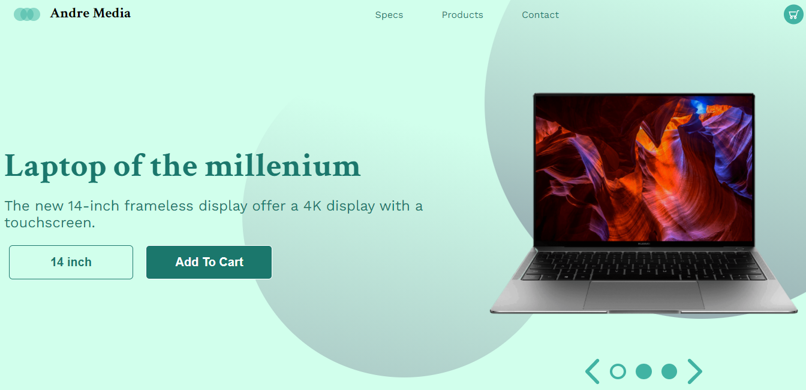
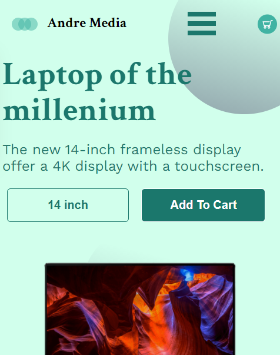
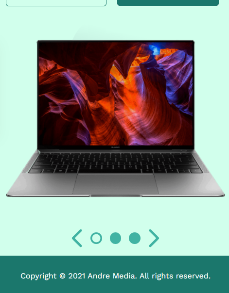

# Andre-Laptop

A modern, responsive landing page template for tech products, built with **HTML5** and **CSS3**. This project features a clean, millenium-inspired aesthetic with mobile-first design principles.



## 📑 Table of Contents
* [Tech Stack](#tech-stack)
* [Features](#features)
* [Installation](#installation)
* [Usage](#usage)
* [License](#license)

## 🛠 Tech Stack
* **Markup:** HTML5 (Semantic Structure)
* **Styling:** CSS3 (Flexbox, Media Queries, Keyframes)
* **Interactivity:** Vanilla JavaScript (DOM Manipulation)
* **Fonts:** Google Fonts (Crimson Text, Work Sans)


## ✨ Features
* **Fully Responsive:** Adapts seamlessly to mobile, tablet, and desktop viewports.
* **Mobile Navigation:** Includes a functional hamburger menu with smooth CSS transitions.
* **Modern UI:** Uses a clean, high-contrast color palette and fluid typography.
* **Cross-Browser Compatible:** Optimized for all modern web browsers.

## Preview







## 🚀 Installation

1. **Clone the repository:**
   ```bash
   git clone [https://github.com/TheStephAndre/Andre-Laptop.git](https://github.com/TheStephAndre/Andre-Laptop.git)
